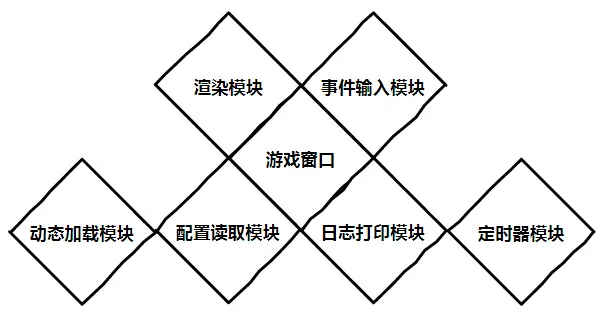

# SDL Game Frame (SDL 游戏框架)

该框架封装了

- 游戏入口函数。
- 游戏的运行过程。
- SDL 各种初始化反初始化流程。
- 游戏窗口创建销毁过程。
- 游戏渲染器创建销毁过程。
- 字体创建销毁过程。
- 消息循环。
- 帧率的计算方法。


用户需要关注的部分

```c
//游戏初始化
int game_init(Sgf_interface* sgf_intf);

//加载游戏资源
int game_load_resources(Sgf_interface* sgf_intf);

// 游戏事件处理
void game_event_processing(SDL_Event* evt);

// 游戏更新
int game_update(Sgf_interface* sgf_intf, float ms);

// 游戏渲染
void game_render(Sgf_interface* sgf_intf, float lag);

// 退出游戏前进行反初始化
void game_quit(Sgf_interface* sgf_intf);

```


框架架构图：（目前只实现了渲染模块，事件模块，游戏窗口）


